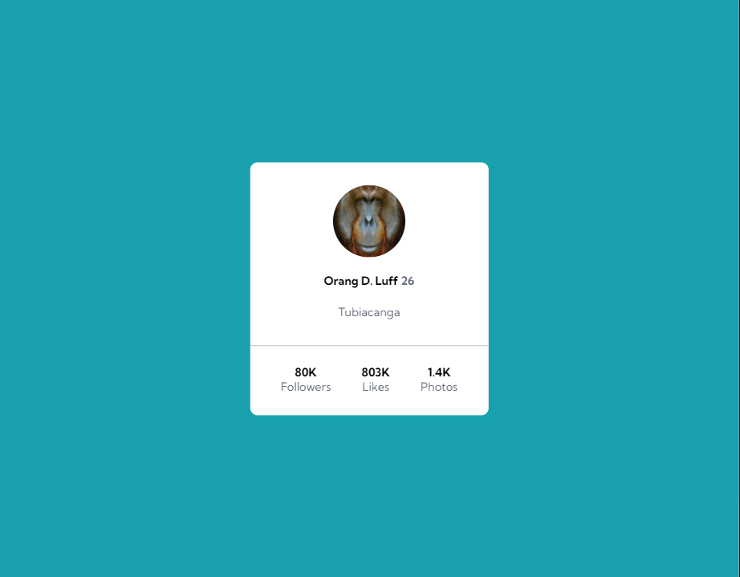
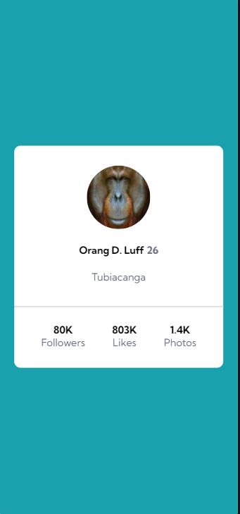

# Profile card component

## Visualização em desktop

 

## Visualização em dispoditivos móveis

(Pressione CTRL + clique para visualizar o projeto em uma nova guia)

## Linguagens utilizadas
- HTML
- CSS

## Inspiração
Projeto básico desenvolvido usando como inspiração um desafio do site FrontEnd Mentor, afim de praticar os conenhecimentos bases em HTML.
